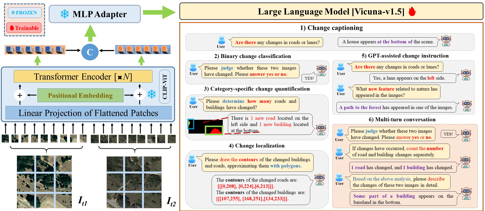

# ChangeChat : Interactive Remote Sensing Change Analysis via Multimodal Instruction Tuning
---

[](https://www.python.org/)
[](https://pytorch.org/)
[](Demo_Link)

**ChangeChat** represents an advanced bitemporal vision-language framework engineered for interactive remote sensing change analysis. This repository provides the code, models, and resources necessary to reproduce the results presented in our paper, "ChangeChat: An Interactive Model for Remote Sensing Change Analysis via Multimodal Instruction Tuning."

---

## 📖 Table of Contents
- [ChangeChat : Interactive Remote Sensing Change Analysis via Multimodal Instruction Tuning](#changechat--interactive-remote-sensing-change-analysis-via-multimodal-instruction-tuning)
  - [📖 Table of Contents](#-table-of-contents)
  - [🌟 Overview](#-overview)
  - [🚀 Key Features](#-key-features)
  - [📚 ChangeChat-87k Dataset](#-changechat-87k-dataset)
  - [Preparations](#preparations)
      - [Installation and Dependencies](#installation-and-dependencies)
      - [Data Preparation](#data-preparation)
  - [Training](#training)
  - [Model Details](#model-details)
      - [Architecture](#architecture)
      - [Pre-trained Weights](#pre-trained-weights)
  - [🔍 Evaluation](#-evaluation)
  - [🏆 Contributions](#-contributions)
  - [📜 Citation](#-citation)
  - [🙏 Acknowledgments](#-acknowledgments)

---

## 🌟 Overview
ChangeChat is the first model designed for **interactive, bitemporal remote sensing (RS) change analysis**, enabling interactive change captioning through **multimodal instruction tuning**. It excels in handling complex queries like **change captioning, category-specific quantification, and precise change localization**, going beyond traditional workflows. Leveraging a **novel chain-of-thought-based(CoT) strategy**, ChangeChat tackles complex RS scenarios with enhanced reasoning. It supports a wide range of change-related tasks and adapts to **multi-turn conversations** with increasingly detailed instructions. 

---


## 🚀 Key Features
- **Interactive Change Analysis**: ChangeChat is the first model to tackle **interactive, bitemporal RS change analysis**. It can respond to a diverse range of change-related queries.

- **Multimodal Instruction Tuning**: ChangeChat leverages multimodal instruction tuning to handle complex queries such as change captioning, category-specific quantification, and change localization.

- **Support for Varied Tasks**: It goes beyond predefined workflows, offering a flexible platform capable of tasks like **change captioning, category-specific quantification and precise change localization.**

- **Chain-of-Thought (CoT) Reasoning**: ChangeChat incorporates a **novel chain-of-thought-based change analysis strategy** to enhance its ability to tackle complex remote sensing scenarios. This can be facilitated through multi-turn conversations where instructions are presented in increasing difficulty.


---
## 📚 ChangeChat-87k Dataset

  This dataset includes 87,195 instructions crafted specifically for remote sensing (RS) change analysis scenarios. We constructed it by integrating rule-based methods—sourcing data from the LEVIR-MCI dataset—with GPT-assisted techniques that tap into ChatGPT’s in-context learning strengths.
  It is critical for ChangeCaht's ability to understand and respond to varied queries by providing it with specialized and diverse training data.

  - Instructions Type

    | Instruction           | Count   | Type                   |
    | --------------------- | ------- | ---------------------- |
    | Change Captioning     | 34,075  | Rule-based             |
    | Binary Detection      | 6,815   | Rule-based             |
    | Change Quantification | 6,815   | Rule-based             |
    | Localization          | 6,815   | Rule-based             |
    | GPT-Assisted          | 26,600  | GPT-assisted           |
    | Multi-Turn            | 6,815   | Rule-based             |
---
## Preparations

### Installation and Dependencies
```bash
# Clone repository
git clone https://github.com/hanlinwu/ChangeChat.git
cd ChangeChat

# Create conda environment
conda create -n changechat python=3.9
conda activate changechat

# Install dependencies
pip install -r requirements.txt

```
Hardware Requirements:

- NVIDIA GPU with ≥48GB VRAM (L20 recommended)
- CUDA 11.7+


### Data Preparation

*   **Datasets:**

    *   **LEVIR-CC:**  The original dataset for change captioning, comprising 10,077 pairs of bitemporal images.  Download instructions can be found at [LEVIR-CC Dataset](https://github.com/Chen-Yang-Liu/LEVIR-CC-Dataset).
    *   **LEVIR-MCI:**  Includes pixel-level change maps for more detailed change analysis. Download instructions can be found at [LEVIR-MCI Dataset](https://huggingface.co/datasets/lcybuaa/LEVIR-MCI/tree/main).
    *   **ChangeChat-87k:**  Our custom dataset of 87,195 instructions.  We will provide a download link to this dataset here:  [Link to ChangeChat-87k Dataset](https://github.com/hanlinwu/ChangeChat/blob/master/GPT-api/LEVIR-MCI-dataset/ChangeChat_instruct_gpt_87k.json).
  
        **ChangeChat-87k Details:** After downloading, the dataset directory should resemble the following structure (within `data/ChangeChat-87k`):

            ```
            ChangeChat-87k/
            ├── LEVIR-MCI-dataset/     # Contains LEVIR-MCI images and change maps
            ├── conversation/          # GPT-generated conversational data
            ├── count/                 # GPT-generated counting data
            ├── gpt4-binary-results.jsonl # Binary classification data generated by GPT-4
            ├── gpt4-count-results.jsonl  # Counting data generated by GPT-4
            ├── ...
            ```

*   **Data Preprocessing:**

    *   The `data/` directory should contain the LEVIR-CC, LEVIR-MCI and ChangeChat-87k datasets. Refer to data loading scripts for detailed data formats.
    *   For using custom data with the same formats, refer to ```./scripts/data_prep.py``` for processing the data.
    *   For ChangeChat-87k dataset, no preprocessing is required.
  
    ```bash
    python scripts/preprocess_data.py --levir_cc_path path/to/levir_cc --levir_mci_path path/to/levir_mci --output_dir data/processed_data
    ```
---

## Training
Make sure you performed the data preparation above. Then, start training as follows:
```bash
    python train.py --config config/default_config.yaml --data_dir data/ChangeChat-87k
```
*   `--config`: Path to the configuration file (e.g., `config/default_config.yaml`).  This file defines hyperparameters, data paths, and other training settings. 
*   `--data_dir`:  Path to the ChangeChat-87k dataset directory.

---

## Model Details
### Architecture

  
  
ChangeChat is based on the LLaVA architecture with adaptations for bitemporal RS change analysis.  It consists of three main components:
*   **Vision Tower:** A pre-trained `CLIP-ViT` model is used to extract visual features from the input images.  The input images are divided into a 14x14 grid of patches, and each patch is encoded into a 1024-dimensional token.
*   **Cross-Modal Adaptor:** A `multi-layer perceptron (MLP)` with one hidden layer is used to align the visual and language modalities. The 1024-dimensional tokens from the vision tower are mapped to 4096 dimensions.
*   **LLM:**  `Vicuna-v1.5` serves as the language model. We fine-tune the LLM using low-rank adaptation (LoRA) to enhance its capabilities in change analysis tasks.
  
### Pre-trained Weights
*   Download the ChangeChat pre-trained weights: (coming soon).

---

## 🔍 Evaluation

*   `eval_cc.sh`:
    ```bash
            bash scripts/eval_cc.sh --model_path path/to/your/model --dataset_path data/LEVIR-CC/test.json
    ```
*   `eval_cc_contour.sh` 
*   `eval_cc_conv.sh`
*   `eval_cc_yn.sh`

Please refer to the evaluation code in those scripts for details. You can find the model file path and evaluation data path in the evaluation script.


*   `funetune_lora.sh`:
     ```bash
            bash scripts/finetune_lora.sh --config config/lora_config.yaml
     ```
*   `finetune.sh`

These scripts are used to fine-tune ChangeChat on different datasets or tasks. Adapt the scripts based on comments.

---

## 🏆 Contributions
- **RS change instruction dataset**. We developed the RS change instruction dataset with 87k instruction-response pairs, using a pipeline that combines rule-based methods with GPT-assisted generation to automatically create instruction-response pairs. It effectively addresses the shortage of instruction-following data in the field of RS change analysis and significantly enhances the performance of the ChangeChat model.
- **ChangeChat**. We introduce ChangeChat, the first bitemporal vision-language model (VLM) specifically designed for interactive remote sensing (RS) change analysis. This innovative model leverages multimodal instruction tuning to serve as a versatile assistant for RS change analysis tasks. By incorporating a novel chain-of-thought-based change analysis strategy, ChangeChat significantly enhances its ability to tackle complex remote sensing scenarios.

---

## 📜 Citation
If you find this paper useful in your research, please consider citing:

```bash
@article{deng2024changechat,
  author    = {Deng, Pei and Zhou, Wenqian and Wu, Hanlin},
  title     = {Changechat: An interactive model for remote sensing change analysis via multimodal instruction tuning},
  journal   = {arXiv preprint arXiv:2409.08582},
  year      = {2024},
  note      = {Available at: \url{https://arxiv.org/abs/2409.08582}}
}
```

---

## 🙏 Acknowledgments
- We express our gratitude to the LLaVA, GeoChat, and LEVIR datasets teams for their foundational contributions to our research.
